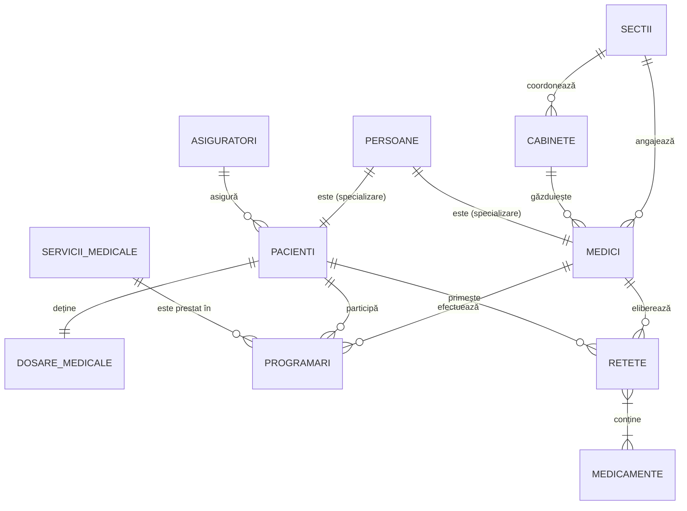
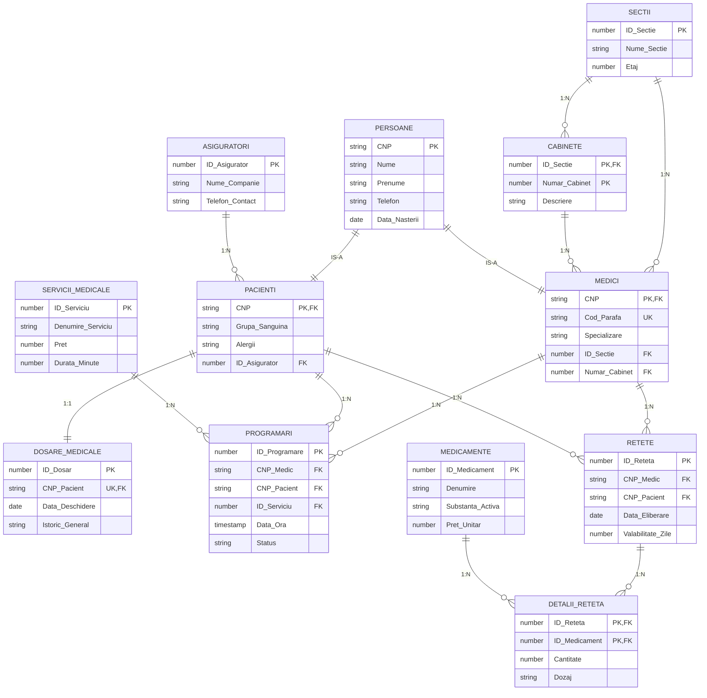

# Diagrame Bază de Date - Sistem Management Clinică

Acest fișier conține diagrama conceptuală și diagrama entitate-relație (ER) pentru sistemul de management al clinicii medicale.

## 1. Diagrama Conceptuală
Această diagramă prezintă entitățile principale și relațiile logice dintre ele, fără a detalia atributele.

## 2. Diagrama Entitate-Relație (ER)
Această diagramă detaliază structura tabelelor, atributele, tipurile de date și constrângerile de integritate.

